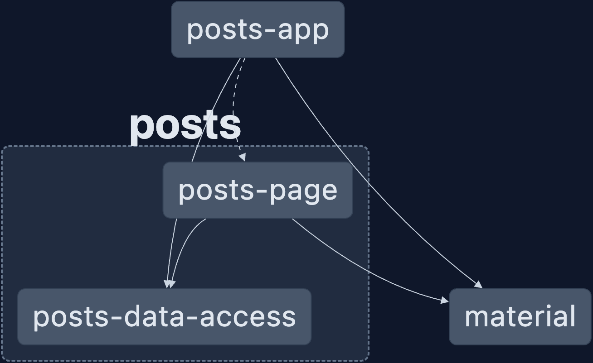

# NgPostHub

✨ **This workspace has been generated by [Nx, a Smart, fast and extensible build system.](https://nx.dev)** ✨

---
## Install Dependencies

To install dependecies just run `npm install` or `npm i`

## Development server

Run `nx serve posts-app` or `npm run start` for a dev server. 

Navigate to http://localhost:4200/. 

The app will automatically reload if you change any of the source files.

---

## Understand this workspace

Run `nx graph` to see a diagram of the dependencies of the projects.

---

In this project I have tired to display a posts using Nx MonoRepo Apporach.

In the above graph you can see the dependencies of the projects and rough architectural overview of project
Here:
1. **Posts App**: Main application.
2. **Posts Data Access**: It has a Ngrx data store for state management and `PostsService` for fetching data.
3. **Posts Page**: Sub app displaying posts.
4. **Material Module**: UI Material module for styling.

---

## Motivation behind Architectural choice:

My main motivation behind choosing Nx and Monorepo approach for this project is the following, although there are multiple benifts of using Nx and Monorepo approach, but below are the ones I find most important:
  
  1. **Code Re-use**: In this setup we further can add multiple apps and these apps can share and reuse code.

  2. **Scalability**: Such architecture are extremly useful for large enterprises, which can be scaled easily and handle growing number of codebases and maintaining consitency across multiple apps be it coding standards and practices, linting and testing standards.

  3. **Support for multiple framework**: we further can add multiple apps developed in otehr framework like React and Node.js and also share common logic between them. 

  The most beauftul thing i love about this is we can share Typescript interfaces library between backend and frontend apps, to ensure type safety and consitencey across apps.

### **Angular Level Performance optimization**:
  1. For displaying posts, I have used `async pipe` on posts observables, keeping it clean and also async pipe unSubscribes Observable on component destroy, so no need to do it manually.
  2. I have provided `trackby` function on `ngFor`, this improves performance by preventing Angular from re-rendering elements that haven't changed.
  3. Used `OnPush Change Detection Strategy` on child component i.e `PostComponent`, which improves performance  as Angular will only check the component for updates when the inputs change.
  
## Gotchas:
Although there are some disadvantages of this setup, the only gotcha that i think mentioning is the initial time required to setup this architecture of the monorepo project, although in long term this is much more beneficial.

## Demo

https://github.com/kartikjagdale/ng-post-hub/assets/7275347/4d87c249-12d3-49ef-93c1-f882df5f9db0

## Further help

Visit the [Nx Documentation](https://nx.dev) to learn more.
